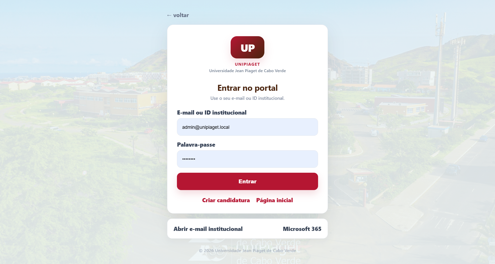
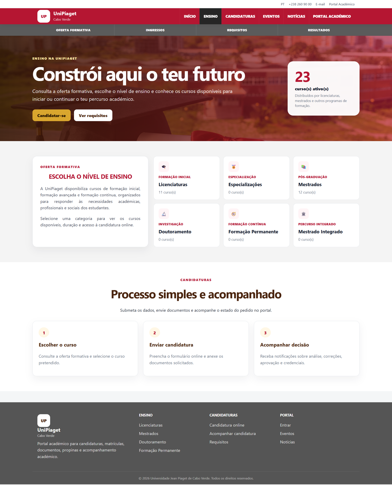
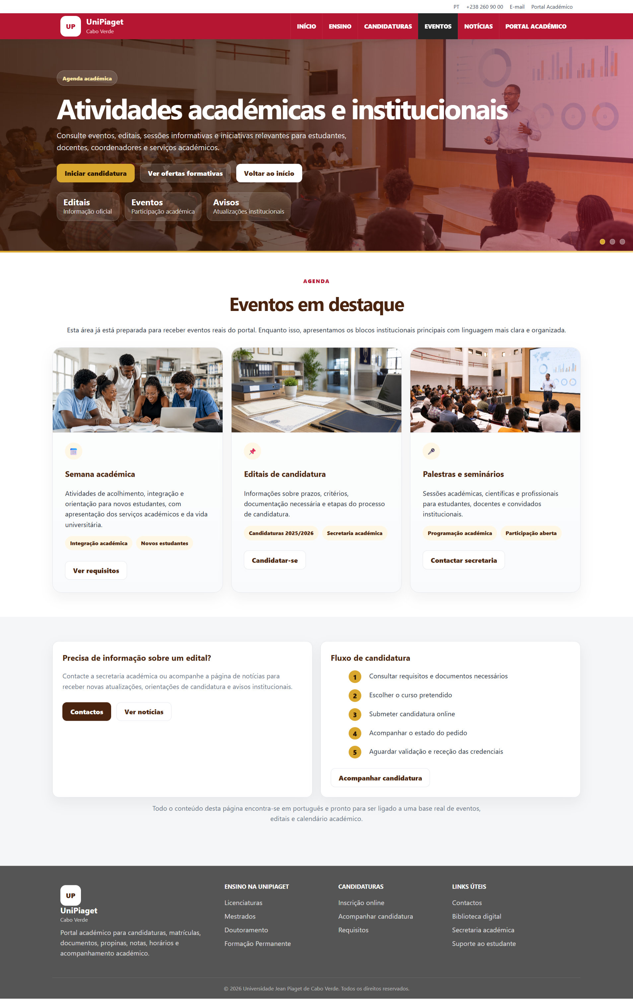
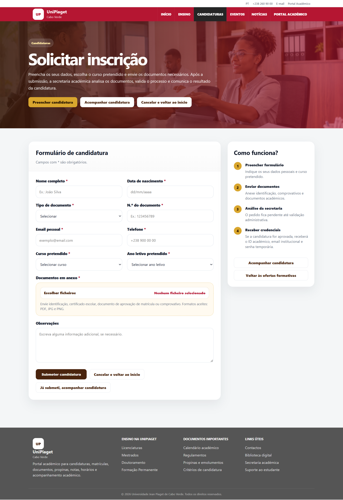

# Portal Académico

Protótipo académico bilingue de um portal de gestão universitária em PHP/MySQL. O projeto é inspirado em fluxos reais de secretarias e estudantes, mas **não representa uma instituição oficial** e usa apenas identidade, contas e documentos fictícios.

[English version](#english) · [Arquitetura](docs/architecture.md) · [Base de dados](database/README.md)

## O que demonstra

- candidaturas com documentos e acompanhamento de estado;
- sete perfis: administrador, secretaria, direção, coordenação, professor, funcionário e aluno;
- cursos, disciplinas, turmas, horários, notas e faltas;
- pagamentos/propinas, pedidos de documentos e relatórios;
- notificações, logs de atividade e autorização por perfil;
- proteção CSRF, cookies de sessão `HttpOnly`/`SameSite`, validação de upload e configuração por ambiente.

## Arranque local com XAMPP

1. Copie o projeto para `htdocs/portal-academico`.
2. Crie a base `portal_academico` no MySQL e importe `database/schema.sql` e depois `database/demo_seed.sql`.
3. Copie `.env.example` para `.env` e ajuste apenas os valores locais. Em XAMPP, `DB_USER=root` e senha vazia são o padrão de instalação, não uma recomendação para produção.
4. Abra `http://localhost/portal-academico/`.

As credenciais de demonstração, quando configuradas pelo seed, são claramente fictícias e devem ser trocadas num ambiente real. Não há demo online no GitHub Pages porque PHP e MySQL precisam de um servidor de aplicação.

## Qualidade e limites

O código mantém prepared statements, escaping centralizado e guards de autorização. O diretório de uploads não é versionado. Antes de produção ainda seriam necessários HTTPS obrigatório, gestão de segredos, backups, revisão de dependências e testes de integração num servidor real.

## English

Academic bilingual prototype of a PHP/MySQL university management portal. It is **not an official institutional system** and contains only fictional identity, accounts and documents.

It demonstrates applications, seven access profiles, courses, subjects, classes, schedules, grades, attendance, payments, document requests, reports, notifications and audit logs. CSRF protection, secure session cookies, environment-based configuration and upload validation are included.

Run it locally with XAMPP by importing `database/schema.sql` and `database/demo_seed.sql`, copying `.env.example` to `.env`, and opening the local URL. GitHub Pages cannot execute this PHP/MySQL application; the repository, screenshots and local setup are the public evidence.

<!-- PUBLICATION-ASSETS:BEGIN -->
## Capturas / Screenshots

The images below are captures from an academic prototype with fictional data. The project does not represent an official institution.

<!-- PUBLICATION-ASSETS:END -->

